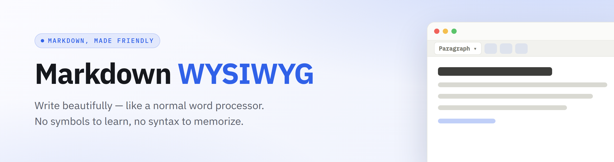

<div align="center">



### A friendly writing app for Markdown — no symbols to learn, no syntax to memorize.

*Write like you would in any word processor. It quietly saves your work as Markdown behind the scenes.*

**100% free · open source · works offline · your writing never leaves your computer**

</div>

---

## 👋 Start here — pick your computer

Click the one you have. Each link is a short, friendly, click-by-click guide.

<div align="center">

[](docs/install-windows.md)
&nbsp;
[](docs/install-mac.md)
&nbsp;
[](docs/install-linux.md)

</div>

> **Never installed anything techy before?** That's okay. The guides assume you've
> never used a "terminal" and walk you through every single step. You really can't
> break anything. 💙

---

## What it looks like


It feels like a regular document. Bold, headings, lists, links, tables, checkboxes —
just click a button, the same way you would anywhere else.

## What it does for you

- ✍️ **Write with buttons, not symbols.** Bold, headings, bullet points, links,
  tables, to‑do lists — all from a friendly toolbar.
- 🔄 **Peek "under the hood" anytime.** Flip to a side‑by‑side view to see the plain
  Markdown your writing becomes. (Curious, not required!)
- 💾 **Save it your way.** Download as Markdown, a web page (HTML), or a PDF.
- 🌗 **Light or dark.** Whichever is kinder to your eyes.
- 🔒 **Private and offline.** After the first setup it needs no internet, and your
  words stay on your own computer.

## Try it in about a minute

Once you've installed Docker (the platform guides above show you how), open your
terminal and paste this **one line**:

```bash
docker run --rm -p 8080:8080 ghcr.io/kbennett2000/markdown-wysiwyg:latest
```

Then open **<http://localhost:8080>** in your web browser. That's it — start typing! ✨

*(The first run downloads the app once. After that it works with no internet at all.)*

To stop it later, go back to the terminal window and press **Ctrl + C**.

## 📖 Take the tour

New here? The **[Using the editor](docs/using-the-editor.md)** guide is a gentle,
picture‑by‑picture walkthrough of everything you can do.

## New to Markdown? (and why this isn't scary)

"Markdown" is just a way of writing plain text that can also remember simple
formatting — like which words are **bold** or which lines are a bullet list. It's
the same friendly format used by GitHub, Reddit, WhatsApp, and lots of note apps.

The thing is, normally you have to *type little symbols* to get that formatting
(like `**bold**` or `# Big heading`). **This app does that for you.** You click a
button, it looks right on screen, and the symbols are handled invisibly. If you ever
get curious, you can flip to the side‑by‑side view and watch it happen. No pressure.

---

<details>
<summary><b>For developers</b> (optional — most people can ignore this)</summary>

<br>

Built with **React + Vite + TypeScript**. Markdown ↔ rich text is handled by
[marked](https://marked.js.org/) and [turndown](https://github.com/mixmark-io/turndown).

```bash
npm install
npm run dev        # local dev server with hot reload
npm run build      # type-check + production build → dist/
```

**Run from source with Docker** (instead of the prebuilt image):

```bash
docker compose up --build      # serves on http://localhost:8080
```

**Change the port** — set `APP_PORT` (the port inside the container) and map it:

```bash
docker run --rm -e APP_PORT=9000 -p 9000:9000 ghcr.io/kbennett2000/markdown-wysiwyg:latest
```

**Optional Google Drive.** Drive is off until configured. Provide a Google OAuth
Client ID at **runtime** and the same image enables it — no rebuild, and the in‑app
"paste a Client ID" prompt is skipped:

```bash
docker run --rm -e GDRIVE_CLIENT_ID=xxxx.apps.googleusercontent.com \
  -p 8080:8080 ghcr.io/kbennett2000/markdown-wysiwyg:latest
```

Full walkthrough (Cloud project, consent screen, authorized origins): **[docs/google-drive.md](docs/google-drive.md)**.
A from‑source build can also bake one in via the `VITE_GDRIVE_CLIENT_ID` build arg.

**Offline by design.** Everything (the editor libraries and the IBM Plex fonts) is
bundled at build time — no CDN, no Google Fonts. The only feature that ever touches
the network is the optional Google Drive integration, which is lazy‑loaded only when
you click a Drive action. Verify with `docker run --network none …`.

The README banner and screenshots are generated locally with Playwright:

```bash
npm run banner        # → docs/images/banner.png
npm run screenshots   # → docs/images/*.png
```

</details>

<div align="center">
<sub>Made with care for people who'd rather write than fiddle with symbols.</sub>
</div>
