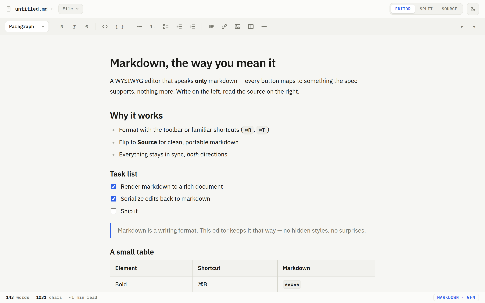
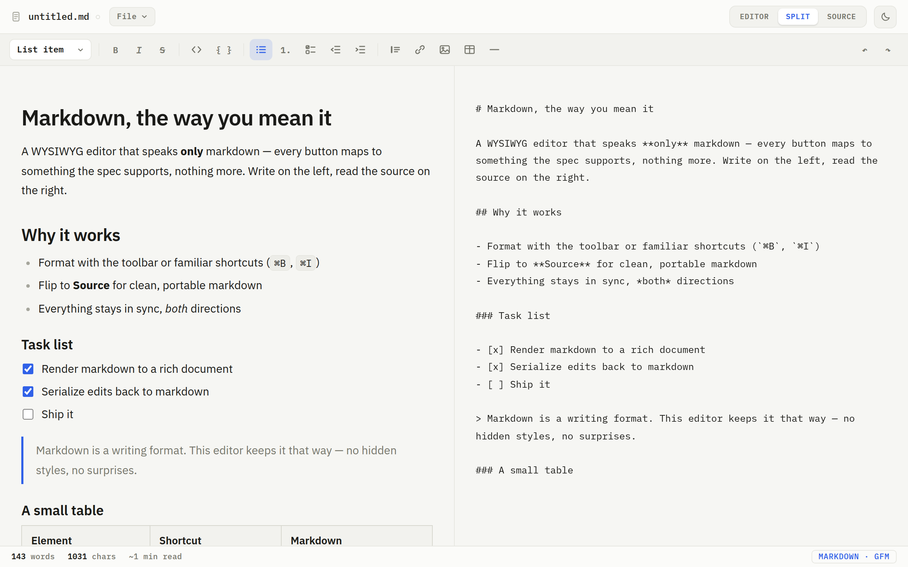
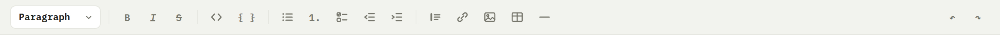
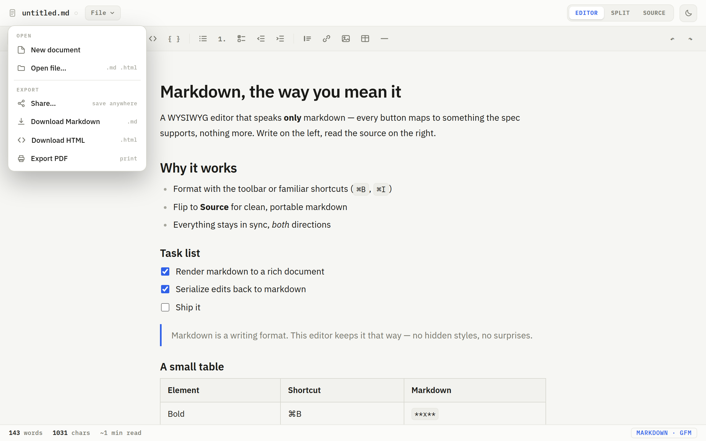
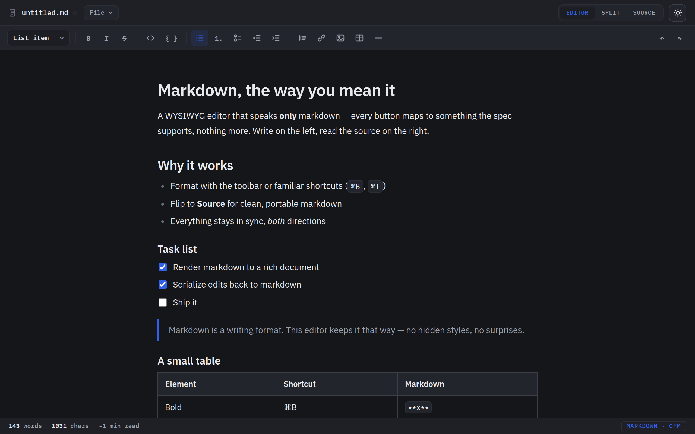

# Using the editor 📖

A gentle, picture‑by‑picture tour. Nothing here is hard, and **you can't break
anything** — if something looks odd, just undo it (Ctrl/⌘ + Z) or refresh the page.
Let's look around.

When you open the editor you'll see a sample document so you have something to play
with. Click anywhere in it and start typing — it behaves just like a normal writing
app.

---

## The three views

In the top‑right corner there are three buttons: **Editor**, **Split**, and **Source**.
They're just three ways of looking at the *same* document.

| Button | What you see | When to use it |
| --- | --- | --- |
| **Editor** | Your nicely‑formatted writing | Almost always — this is the comfy one ✨ |
| **Split** | Formatted writing *and* the plain text, side by side | When you're curious how it works |
| **Source** | Only the plain "Markdown" text | If you want to copy the raw text somewhere |

Here's **Split** view — your writing on the left, the plain Markdown it becomes on the
right. They stay in sync as you type:

> You never *have* to look at the Source or Split views. They're there if you're
> curious — that's all.

---

## The toolbar

Along the top is a row of buttons. Click a button, or first select some text and then
click, just like in any word processor.

From left to right:

- **Paragraph ▾** — the style menu. Turn a line into a **big heading**, a smaller
  heading, or back to normal text.
- **B** / **I** / **S** — **bold**, *italic*, and ~~strikethrough~~.
- **`</>`** and **`{ }`** — for showing computer code (most people won't need these).
- **Lists** — bullet points, numbered lists, and **to‑do checklists** ☑️. The two
  arrow buttons next to them push a list item in or out (handy for sub‑points).
- **Quote** — sets text aside as a quotation.
- **Link** 🔗 — turn words into a clickable link.
- **Image** 🖼️ — drop in a picture by its web address.
- **Table** — insert a little grid.
- **Line** — a horizontal divider across the page.
- **↶ / ↷** — undo and redo, on the far right.

Don't feel you need to memorize these — hover over any button and it tells you what it
does.

---

## Saving and sharing your work

Click **File** in the top‑left to open the menu:

- **New document** — start fresh.
- **Open file…** — open a Markdown or HTML file from your computer. (This is also how
  you open something from **Google Drive** — just pick it from your Drive folder.)
- **Share…** — send your writing to your device's share sheet: on a phone that
  includes **Save to Drive**, email, messaging, and more. On a desktop (or over a
  plain `http://…` address) it simply downloads the file instead.
- **Download Markdown** — save your writing as a `.md` text file.
- **Download HTML** — save it as a web page.
- **Export PDF** — save a tidy PDF (great for printing or emailing).

Your writing lives in your browser while you work, and it only leaves your computer
when *you* choose to share or download it. Nothing is ever uploaded automatically —
there's no account to sign into and no internet required.

---

## Light or dark

See the little **moon/sun button** in the top‑right? Click it to switch between a
bright theme and a dark one. Pick whatever's easier on your eyes:

---

## That's the whole tour! 🎉

Really — that's it. Open the editor, click around, and write. If you ever wonder
"what does this button do?", just hover over it.

Happy writing! 💙

---

[← Back to the main page](../README.md)
